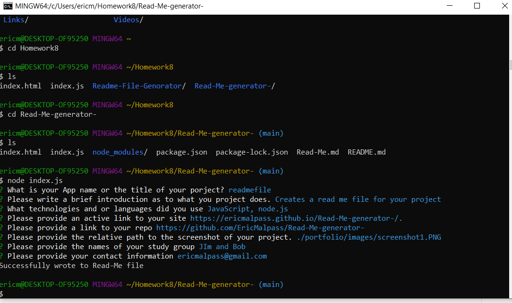

# Readme-File-Genorator
The reason for this application is to create a README file for the user.
The application will generate a file that will be named Read-Me.md I did this 
in order to no t overwrite the README file that is already there though you can later change the name.

Before you can run the index.js the user needs to run npm init and then install the inquirer, npm as well. 
This is described in the video below.

screenshot:

Repo:
https://github.com/EricMalpass/Read-Me-generator-

Video example:
Check out this video I recorded with Screencastify: https://drive.google.com/file/d/1hXsapJ0ejbqywMoRPxpfYZqb9M-rrccb/view

I recieve alot of support from my study group, tutur, askbcs tuturs, and various websites:

Study Group:

-Li Hua Anderson

-Sam Oberg

-Kelly Dean Mahaffey

Tutur

-Quint Turner
